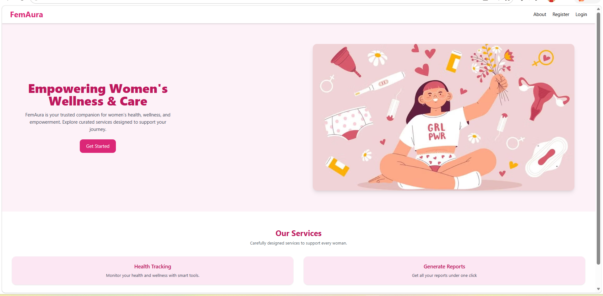
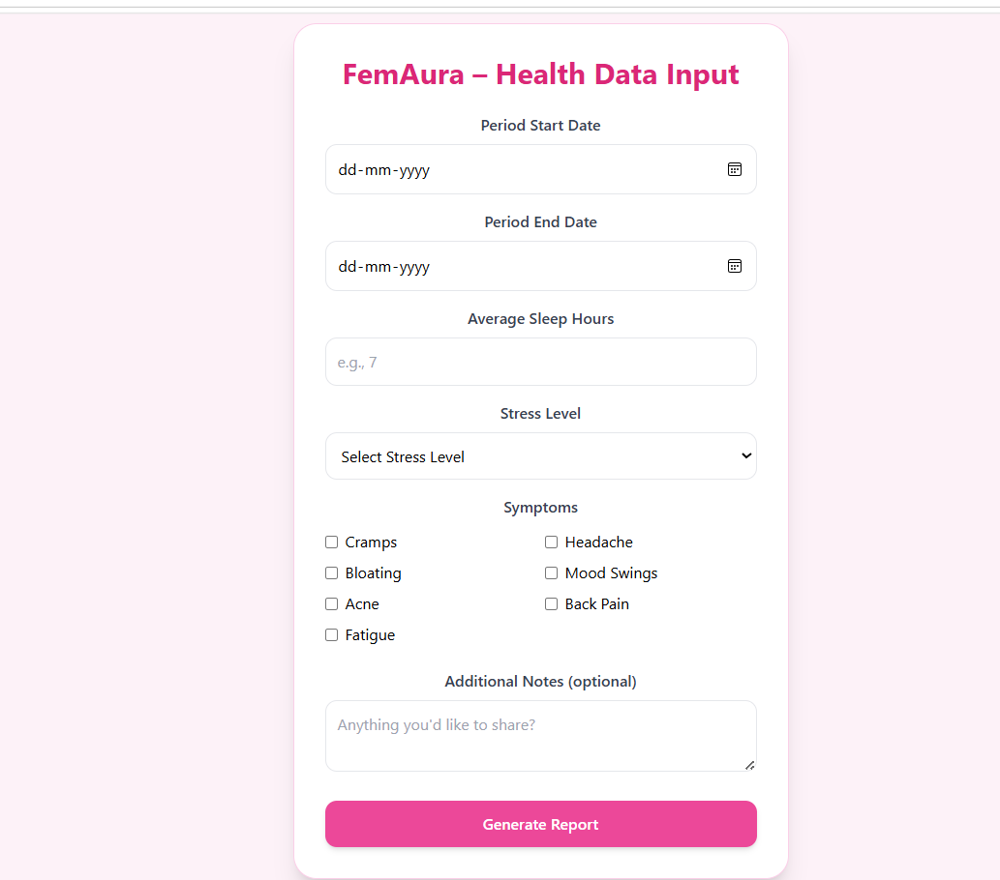
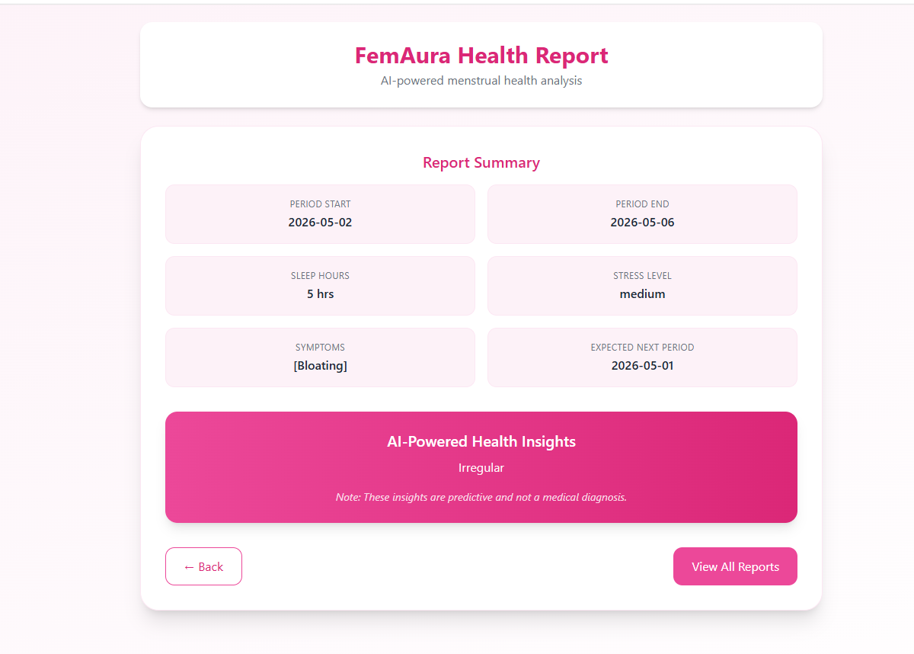

# FemAura – AI Partner for Menstrual Health

FemAura is an AI-powered menstrual health tracking application designed to help users monitor menstrual cycles, detect irregularities, and generate personalized health insights. The project combines full-stack web development with machine learning to provide predictive analysis for potential PCOD/PCOS conditions.

---

## Features

- User Registration & Login Authentication
- Menstrual Cycle Tracking
- Historical Health Record Management
- AI-Based Cycle Analysis
- PCOD/PCOS Prediction
- Personalized Health Reports
- RESTful API Integration
- Secure Backend Services

---

## Tech Stack

### Frontend
- React.js


### Backend
- Java
- Spring Boot
- Hibernate
- REST APIs

### Database
- MySQL

### AI / Machine Learning
- Python
- FastAPI


### Additional Technologies
- Git & GitHub

---

## AI Engine

Built and deployed a machine learning prediction service using FastAPI and Scikit-learn. Implemented a Random Forest Classifier to analyze menstrual cycle patterns and predict potential PCOD/PCOS conditions through REST API endpoints.

---

## System Overview

The application follows a monolithic architecture consisting of:
- A React frontend for user interaction
- A Spring Boot backend for authentication, APIs, and business logic
- A FastAPI-based AI service for machine learning predictions
- A MySQL database for storing user and health-related data

---

## Project Structure

```text
frontend/        -> React frontend
backend/         -> Spring Boot backend
ai-engine/       -> Python AI/ML prediction service
screenshots/     -> Application screenshots
```

---

## Screenshots

### Registration Page


### Login Page


### Dashboard


### FemAura Input Form


### Health Report


---

## Installation & Setup

### Frontend

```bash
cd frontend
npm install
npm start
```

### Backend

```bash
cd backend
mvn spring-boot:run
```

### AI Engine

```bash
cd ai-engine
pip install -r requirements.txt
python -m uvicorn app:app --reload
```

---

## API Endpoint

### Prediction API

```http
POST /predict
```

Used to analyze menstrual cycle data and generate AI-based predictions for cycle irregularities and potential PCOD/PCOS conditions.

---

## Future Enhancements

- Advanced AI-based health recommendations
- Real-time notifications
- Mobile application support
- Improved predictive analytics
- Doctor consultation integration

---

## Contributors

- Shresta Rai

---

## License

This project is developed for academic and learning purposes.
